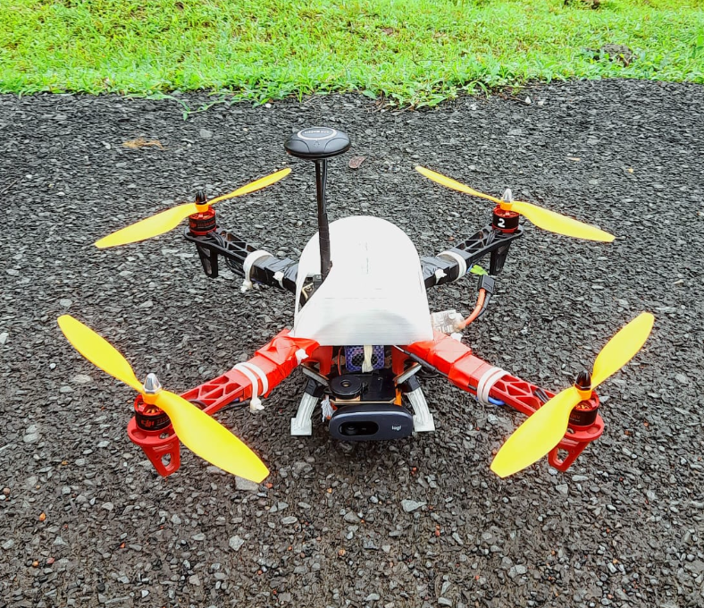
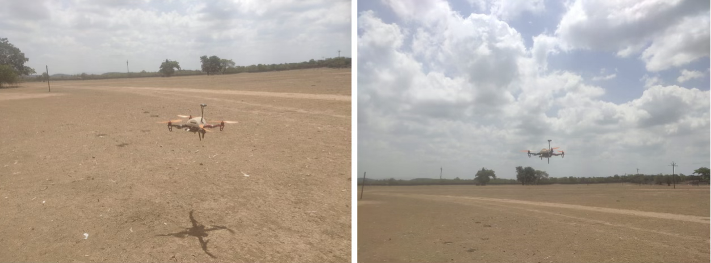
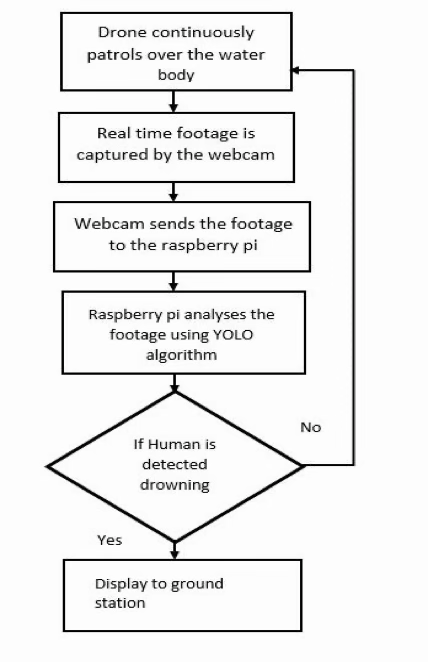
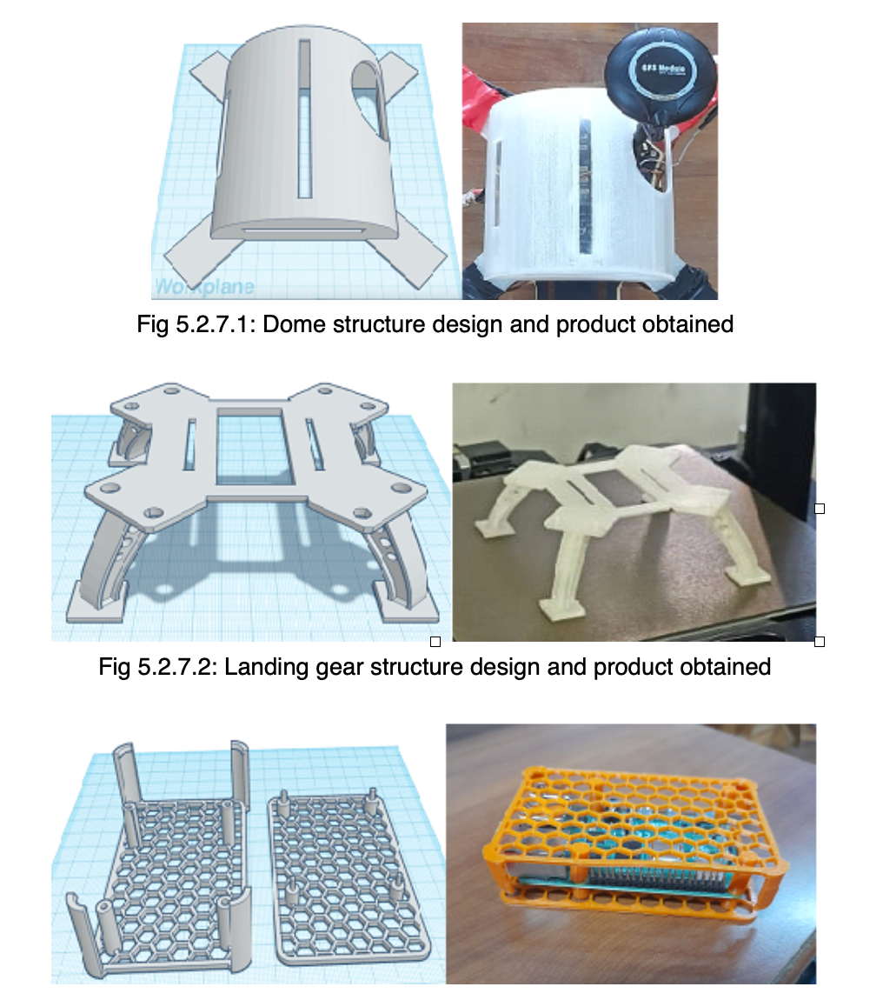
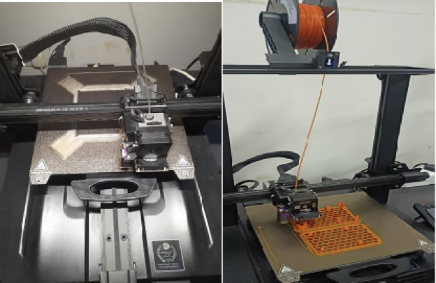
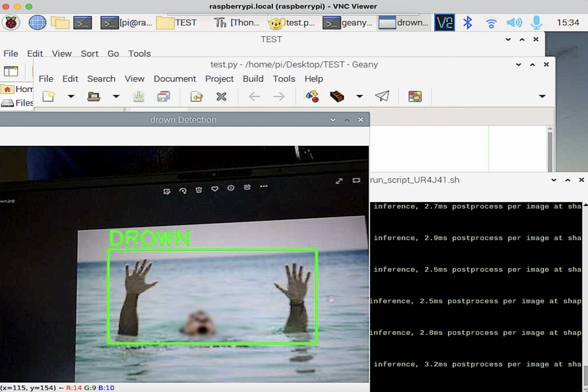
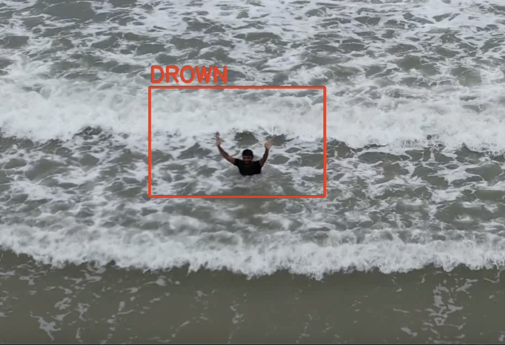
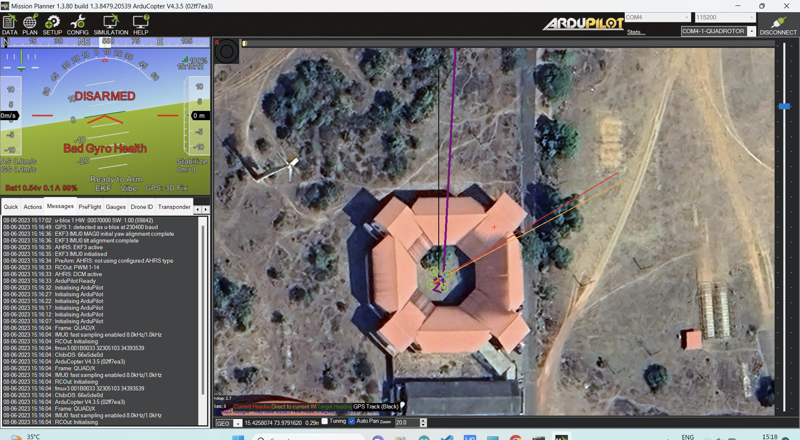
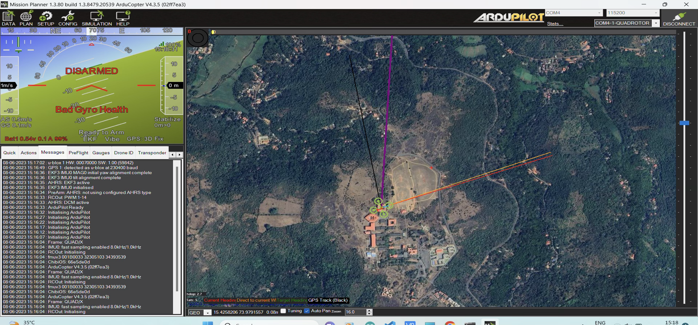

<div align="center">

# Drone-Based Human Drowning Detection Using Image Processing

### Computer vision and drone-based prototype for faster drowning-risk detection and rescue response support

<br>


</div>

---

## Project Overview

Drowning incidents require fast detection, accurate location awareness, and quick response from rescue teams. Traditional monitoring near beaches, lakes, pools, and other water bodies depends heavily on manual observation, which can be limited by distance, visibility, weather, and human response time.

This project presents a drone-based human drowning detection system using image processing and object detection. The prototype combines a quadcopter drone, Raspberry Pi-based image-processing unit, camera input, GPS support, and computer vision techniques to identify humans in water and support faster rescue decision-making.

---

## Problem Statement

Water safety monitoring is difficult in large, crowded, or remote water bodies. Lifeguards and rescue personnel may not always be able to identify a person in distress quickly, especially when visibility is poor or the incident occurs far from the shore.

The goal of this project was to explore whether a drone-mounted vision system can assist rescue teams by scanning water areas, detecting possible drowning-risk situations, and improving situational awareness.

---

## Objectives

| Objective                    | Description                                                                    |
| ---------------------------- | ------------------------------------------------------------------------------ |
| Human Detection              | Detect humans in water using image-processing and object-detection techniques  |
| Real-Time Monitoring         | Process camera footage from a drone-mounted image-processing unit              |
| Rescue Support               | Help lifeguards or authorities identify potential incidents faster             |
| Edge Processing              | Run the detection workflow using Raspberry Pi and camera input                 |
| Ground Station Communication | Display detection output to a ground station using VNC                         |
| Prototype Validation         | Test drone flight, communication range, detection distance, and processing lag |

---

## Solution Approach

The system was designed as a hardware-software prototype.

The drone patrols over a water body and captures real-time footage using an onboard camera. The footage is sent to a Raspberry Pi image-processing unit, where computer vision techniques are used to detect humans. If a person is detected, the system displays the detection output with a bounding box and sends the processed view to the ground station.

### High-Level Workflow

```
Drone patrols over water body
          ↓
Camera captures real-time footage
          ↓
Raspberry Pi receives video input
          ↓
Image-processing model analyzes footage
          ↓
Human / drowning-risk posture is detected
          ↓
Detection output is displayed to ground station
          ↓
Rescue team can respond faster
```

---

## Visual Walkthrough

### Prototype Build

The final prototype combines the quadcopter drone frame, GPS module, camera, Raspberry Pi-based image-processing unit, and custom 3D-printed support components.

<p align="center">
  
  
</p>

<p align="center">
  <b>Final drone prototype with mounted camera, GPS module, and image-processing unit</b>
</p>

---

### System Workflow

The drone continuously monitors the water body, captures live footage, processes the feed on Raspberry Pi using YOLO/OpenCV, and displays detection output to the ground station.

<p align="center">
  
</p>

<p align="center">
  <b>End-to-end workflow from drone monitoring to ground-station display</b>
</p>

---

### Custom 3D-Printed Components

Custom-designed and 3D-printed parts were used to improve component mounting, support the drone structure, and protect the onboard image-processing hardware.

<p align="center">
  
  
</p>

<p align="center">
  <b>3D-designed and printed drone support structures, landing gear, and Raspberry Pi casing</b>
</p>

---

### Drowning Detection Output

The detection model analyzes aerial footage and marks the detected drowning-risk subject using a bounding box and label.

<p align="center">
  
  
</p>

<p align="center">
  <b>Sample drowning-detection output using object detection</b>
</p>

---

### Ground Station and GPS Monitoring

Mission Planner was used for drone setup, GPS monitoring, and ground-station visualization during testing.

<p align="center">
  
  
</p>

<p align="center">
  <b>Ground-station view showing GPS and Mission Planner monitoring</b>
</p>

---

## System Architecture

| Component                 | Purpose                                                                  |
| ------------------------- | ------------------------------------------------------------------------ |
| Quadcopter Drone          | Aerial platform for monitoring water bodies                              |
| Pixhawk Flight Controller | Controls drone movement, stabilization, and flight commands              |
| GPS Module                | Supports location tracking of the drone                                  |
| Raspberry Pi 4            | Edge device for running image-processing workflow                        |
| Webcam / Camera           | Captures real-time footage from the drone                                |
| Python                    | Main programming language used for image processing                      |
| OpenCV                    | Computer vision library used for baseline detection and video processing |
| YOLOv8 / Ultralytics      | Object detection model workflow used for detecting humans                |
| Mission Planner           | Ground control and drone configuration software                          |
| VNC Server                | Enables communication between Raspberry Pi and ground station            |
| MakeSense.ai              | Used for dataset annotation                                              |
| Google Colab              | Used for model training workflow                                         |
| Tinkercad / 3D Printing   | Used for supporting component design and mounting                        |

---

## Methodology

| Stage                    | Work Completed                                                                                                |
| ------------------------ | ------------------------------------------------------------------------------------------------------------- |
| Research                 | Studied drone-based search-and-rescue systems and computer vision drowning-detection approaches               |
| Hardware Assembly        | Built the quadcopter using frame, motors, ESCs, flight controller, GPS, battery, and power distribution board |
| Image Processing Setup   | Integrated Raspberry Pi and camera/webcam as the image-processing unit                                        |
| Dataset Preparation      | Collected and annotated images for human/drowning detection                                                   |
| Model Workflow           | Prepared dataset configuration and trained object-detection workflow using Google Colab                       |
| Detection Implementation | Used Python, OpenCV, and YOLO-based detection methods                                                         |
| Ground Station Setup     | Used VNC to view processed footage from Raspberry Pi on a laptop                                              |
| Testing                  | Tested drone flight, real-time detection, communication, and prototype performance                            |

---

## Prototype Results

| Metric                                   |        Result |
| ---------------------------------------- | ------------: |
| Average flight height during testing     |         6–7 m |
| Drone weight                             |      1.381 kg |
| Battery discharge time to 20%            | Around 10 min |
| Transmitter range                        |        1500 m |
| Raspberry Pi hotspot communication range |          90 m |
| Average detection distance               |         4–5 m |
| Real-time processing lag                 |  Around 5 sec |
| Prototype cost                           |  ~$481.45 USD |
| Cost excluding rented items              |  ~$306.23 USD |

> Cost conversion is approximate and based on the INR to USD exchange rate used at the time of documentation.

---

## Key Features

| Feature                    | Description                                                     |
| -------------------------- | --------------------------------------------------------------- |
| Drone-Based Monitoring     | Allows wider water-area coverage compared to manual observation |
| Real-Time Video Processing | Processes live camera footage for detection                     |
| Human Detection            | Identifies humans using computer vision/object detection        |
| Bounding Box Output        | Displays detected person location visually                      |
| Ground Station View        | Enables operator monitoring through VNC                         |
| GPS-Aware System Design    | Supports location-focused rescue response planning              |
| Public Safety Use Case     | Designed for beaches, lakes, pools, and remote water bodies     |

---

## Repository Structure

```
drone-drowning-detection/
│
├── README.md
├── requirements.txt
├── .gitignore
│
├── src/
│   └── person_detection_baseline.py
│
├── config/
│   └── dataset.yaml
│
├── reports/
│   ├── project_report.pdf
│   └── project_synopsis.pdf
│
├── presentations/
│   └── Project_Idea_Presentation.pdf
│
├── assets/
    ├── drone_built.png
    ├── drone_flight_test.png
    ├── drone_parts_3d_printing.png
    ├── drone_parts_3d_printing_machine.png
    ├── drowning_detection_live.png
    ├── drowning_detection_ouput.png
    ├── gps_output.png
    ├── gps_output_campus.png
    └── system_workflow.png


```

---

## Setup and Usage

For installation steps, dependencies, and running instructions, see: [Setup Guide](SETUP.md)

---

## Results and Business Impact

This project demonstrates how computer vision and drone technology can be combined to support faster emergency response in water-safety scenarios.

| Impact Area        | Value Created                                                                   |
| ------------------ | ------------------------------------------------------------------------------- |
| Faster Detection   | Reduces dependency on manual scanning of large water areas                      |
| Better Coverage    | Drone can monitor areas that are difficult for lifeguards to observe directly   |
| Rescue Support     | Detection output can help authorities focus attention on high-risk zones        |
| Scalable Use Case  | Can be extended to beaches, pools, lakes, dams, and remote water bodies         |
| Data-Driven Safety | Captured footage and detections can support safety analysis and future planning |

---

## Limitations

| Limitation               | Explanation                                                                             |
| ------------------------ | --------------------------------------------------------------------------------------- |
| Battery Life             | Prototype battery performance limited continuous flight time                            |
| Processing Lag           | Real-time footage had an observed delay of around 5 seconds                             |
| Environmental Conditions | Weather, lighting, water movement, and visibility can affect detection quality          |
| Dataset Size             | Model performance can improve with a larger and more diverse drowning-specific dataset  |
| Testing Constraints      | Real-world testing was limited by location availability, weather, and safety conditions |

---

## Future Enhancements

* Improve detection accuracy using a larger and more diverse water-safety dataset
* Add GPS-tagged real-time alerts for rescue teams
* Build a mobile or web dashboard for lifeguard monitoring
* Add autonomous drone patrol routes
* Add night-surveillance support using low-light or thermal cameras
* Reduce processing delay through model optimization
* Add lifebuoy-carrying capability for emergency response
* Improve communication between drone and ground station
* Monitor weather conditions before and during drone deployment

---

## Skills Demonstrated

| Area                    | Skills                                                                       |
| ----------------------- | ---------------------------------------------------------------------------- |
| Computer Vision         | OpenCV, YOLO, image processing, object detection                             |
| Data Workflow           | Dataset preparation, annotation, YAML configuration, model training workflow |
| Hardware Integration    | Drone assembly, Raspberry Pi integration, camera setup, GPS module           |
| Software Implementation | Python scripting, video capture, bounding-box visualization                  |
| Systems Thinking        | Drone-to-ground-station communication and rescue workflow design             |
| Product Thinking        | Public-safety use case, operational constraints, future roadmap              |
| Analytical Thinking     | Testing observations, limitations, and improvement planning                  |

---

## Portfolio Relevance

This project highlights the ability to:

* Frame a real-world public-safety problem
* Design a system-level solution
* Work with data, models, hardware, and software
* Communicate technical work in a business-impact-focused way
* Evaluate prototype performance using measurable metrics
* Identify limitations and propose future improvements

---

<div align="center">

### Author - **Hrishad Amre**

Electronics and Telecommunication Engineering <br>
Goa College of Engineering

</div>
